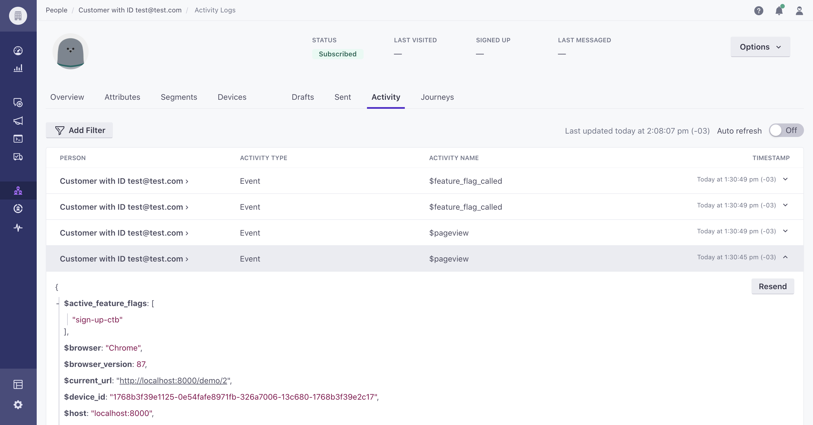

# Customer.io Plugin

Send event data into [Customer.io](https://customer.io/). User emails will also be sent if available.

## Installation

1. Open PostHog.
1. Go to the Apps page from the sidebar.
1. Switch to the Repository tab.
1. Find this app (Customer.io) in the list.
1. Install it and immediately provide your [Customer.io](https://customer.io/) Site ID and API Key in the configuration pane.
1. Enable the app and watch your 'People' list get populated in Customer.io as events come into PostHog!
